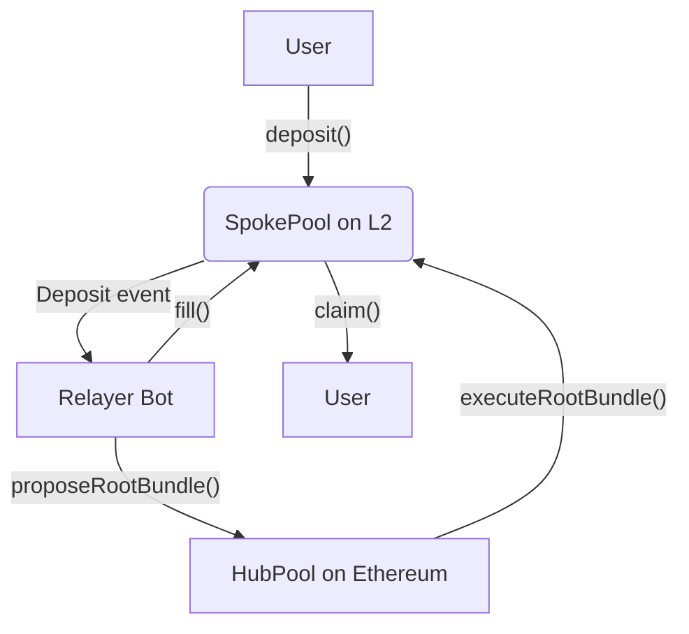

# Across SDK – Deep Technical Reference

> **Goal**: Provide a comprehensive technical map for engineers to understand the codebase architecture and start contributing effectively. Updated as of the current branch.

---

## 1. Overview & Quick Start

**Across** is a cross-chain bridge optimized for _speed_ and _capital efficiency_. This SDK provides:

1. **Type-safe contract interactions** via typechain-generated wrappers (ethers/viem)
2. **Off-chain workflows** for relayers, liquidity providers, and frontend integrations
3. **Multi-chain support** for EVM chains and Solana

### Tech Stack

- **Language**: 100% TypeScript (Node.js ≥ 20.18.0)
- **Testing**: Jest + ts-jest for unit tests, Hardhat for e2e
- **Build**: Custom TypeScript compilation to CJS/ESM/types
- **Smart Contracts**: Interfaces only (see [across-protocol/contracts](https://github.com/across-protocol/contracts))

### Quick Setup

```bash
yarn install        # Install dependencies + build bigint-buffer
yarn build          # Compile to dist/ (CJS, ESM, types)
yarn test           # Run unit tests
yarn test:e2e       # Run integration tests (requires RPC)
```

### Common Tasks Quick Reference

| I want to...                  | Look at...                                          |
| ----------------------------- | --------------------------------------------------- |
| Track deposits as a relayer   | `src/clients/SpokePoolClient/` → `getDeposits()`    |
| Calculate fees for a transfer | `src/relayFeeCalculator/` → `calculateRelayerFee()` |
| Get token prices              | `src/priceClient/` → `getPriceByAddress()`          |
| Add a new chain               | Section 13 of this doc                              |
| Debug an issue                | Enable `ACROSS_LOG_LEVEL=debug`                     |
| Understand the bridge flow    | Section 5 - Transfer Flow diagram                   |

---

## 2. Repository Structure

### Root Directory

| Path                | Purpose                                         |
| ------------------- | ----------------------------------------------- |
| `src/`              | Main library code – exported by `src/index.ts`  |
| `contracts/`        | Solidity mocks for testing                      |
| `e2e/`              | End-to-end integration tests (fork/live chains) |
| `test/`             | Jest unit tests with mocks                      |
| `scripts/`          | Build helpers (bigint-buffer shim, etc.)        |
| `dist/`             | Build output (CJS, ESM, types)                  |
| `artifacts/`        | Compiled contract artifacts                     |
| `typechain-types/`  | Additional generated TypeScript types           |
| `hardhat.config.ts` | Hardhat configuration for local chains          |
| `tsconfig.*.json`   | TypeScript configs (base, build, lint)          |

### Core Source Directory (`src/`)

```text
addressAggregator/   # Address aggregation from multiple sources
apiClient/           # API client abstractions (prod/mock)
arch/                # Chain-specific code (evm/, svm/)
  ├─ evm/           # Ethereum Virtual Machine chains
  └─ svm/           # Solana Virtual Machine
caching/             # Storage layers (Memory, IPFS, Arweave)
clients/             # Contract & service clients
  ├─ mocks/         # Mock implementations for testing
  └─ */             # HubPool, SpokePool, ConfigStore, etc.
coingecko/           # CoinGecko price feed integration
contracts/           # Contract interfaces and utilities
gasPriceOracle/      # Gas price estimation
  └─ adapters/      # Chain-specific adapters
interfaces/          # TypeScript interfaces & domain types
lpFeeCalculator/     # LP fee calculation logic (has README)
merkleDistributor/   # Merkle tree distribution (has README)
pool/                # Pool management & TransactionManager
priceClient/         # Token price feeds (has README)
  └─ adapters/      # Multiple price sources
providers/           # RPC provider wrappers (cache, retry, rate-limit)
  └─ mocks/         # Mock providers for testing
relayFeeCalculator/  # Relay fee calculation (has README)
typeguards/          # Runtime type validation
utils/               # Pure utility functions
  └─ abi/           # Contract ABIs and typechain output
```

**Note**: Several modules have their own README files with detailed documentation. Check individual directories for deeper insights.

---

## 3. Core Components & Architecture

### Primary Clients

| Client                | Location                               | Purpose                                                                |
| --------------------- | -------------------------------------- | ---------------------------------------------------------------------- |
| **HubPoolClient**     | `src/clients/HubPoolClient.ts`         | Manages liquidity on mainnet, tracks root bundles & cross-chain state  |
| **SpokePoolClient**   | `src/clients/SpokePoolClient/`         | Handles deposits/fills on each chain, emits events for relayers        |
| **ConfigStoreClient** | `src/clients/AcrossConfigStoreClient/` | Reads on-chain config (token routes, rate models, emergency pause)     |
| **BundleDataClient**  | `src/clients/BundleDataClient/`        | Constructs merkle trees for batch settlements, used by dataworker bots |

### Supporting Infrastructure

| Component           | Location                       | Purpose                                                                 |
| ------------------- | ------------------------------ | ----------------------------------------------------------------------- |
| **Gas Oracles**     | `src/gasPriceOracle/adapters/` | Chain-specific gas price estimation (Ethereum, Arbitrum, Solana, Linea) |
| **Price Feeds**     | `src/priceClient/adapters/`    | Token prices from multiple sources (CoinGecko, DefiLlama, Across API)   |
| **Fee Calculators** | `src/{lp,relay}FeeCalculator/` | Deterministic fee computation matching on-chain logic                   |
| **RPC Providers**   | `src/providers/`               | Enhanced providers with retry, rate-limiting, and caching               |
| **API Client**      | `src/apiClient/`               | Typed client for Across backend services                                |

---

## 4. Type System & Developer Experience

### Type Generation

- **Contract Types**: `typechain` generates typed wrappers in `src/utils/abi/typechain/`
- **Domain Models**: `src/interfaces/` contains business logic types (prefer these over raw types)
- **Runtime Validation**: `src/typeguards/` provides type guards for external data

### Key Interfaces

```typescript
// Common domain types you'll use:
interface DepositRequest { ... }  // User deposit on source chain
interface RelayExecution { ... }  // Relayer fill on destination
interface BundleEvaluation { ... } // Merkle root computation
interface LpFeeRequest { ... }    // Fee calculation inputs
```

### Development Tools

- **Linting**: ESLint with TypeScript rules (`.eslintrc.js`)
- **Formatting**: Prettier auto-format on save (`.prettierrc`)
- **Type Checking**: Strict mode enabled, null checks enforced
- **Node Version**: Use Node.js ≥ 20.18.0 (see `.nvmrc`)

---

## 5. Cross-Chain Transfer Flow (EVM example)



1. **Deposit**: user calls `deposit()` on a SpokePool; token locked & `Deposit` event emitted.
2. **Relayer**: bot listens, submits _fill_ tx (+ front-liquidity) and later proposes a **root bundle** to the HubPool.
3. **Root Execution**: after challenge window, HubPool executes root, sending canonical token to L2 via canonical bridge.
4. **Claim**: SpokePool releases LP escrow or refunds relayer based on bundle data.

All steps have mirrored helpers in the relevant client classes.

---

## 6. Extensibility via Adapter Pattern

### Gas Price Adapters

All adapters implement `GasPriceOracleAdapter` interface:

```ts
export interface GasPriceOracleAdapter {
  getGasPrice(params: GasPriceQuery): Promise<bigint>
}
```

**Available adapters:**

- `ethereum.ts` – Etherscan API with RPC fallback
- `arbitrum.ts` – L1 + L2 gas via sequencer endpoint
- `solana.ts` – Compute unit pricing via `getRecentPrioritizationFees`
- `linea-viem.ts` – Linea-specific gas estimation

### Price Feed Adapters

Implement `PriceAdapter` for new price sources:

- `coingecko.ts` – Primary price source
- `defiLlama.ts` – Alternative DeFi prices
- `acrossApi.ts` – Across-specific token prices

### Provider Enhancement Stack

Composable middleware pattern:

```
Raw Provider → RetryProvider → RateLimitedProvider → CachedProvider
```

Each layer is independently testable and configurable.

---

## 7. Testing Strategy

### Test Categories

| Type            | Location         | Purpose                    | Speed          |
| --------------- | ---------------- | -------------------------- | -------------- |
| **Unit Tests**  | `test/*.test.ts` | Pure logic, mocked deps    | Fast (< 1s)    |
| **Integration** | `e2e/*.e2e.ts`   | Real contract interactions | Medium (5-30s) |
| **Fork Tests**  | `e2e/*fork*`     | Mainnet state testing      | Slow (30s+)    |

### Running Tests

```bash
# Quick unit tests during development
yarn test SpokePoolClient

# Full test suite
yarn test

# E2E tests (requires RPC endpoints)
yarn test:e2e

# With coverage
yarn test --coverage
```

### Mocking Strategy

- **Clients**: Use `src/clients/mocks/` for predictable contract behavior
- **Providers**: Use `src/providers/mocks/` to avoid RPC calls
- **Time**: Use `test/utils/utils.ts` helpers for time manipulation

### Key Testing Utilities

```typescript
import { setupSpokePool, depositV3, fillV3 } from "./utils"
import { createSpyLogger } from "./utils/utils"
```

---

## 8. Build & Publishing

### Build Process

```bash
yarn build        # Runs all build steps
├─ yarn build:cjs # CommonJS to dist/
├─ yarn build:esm # ES Modules to dist/across.esm.js
└─ yarn build:ts  # Type definitions to dist/
```

### Release Process

1. **Version Bump**: Update version in `package.json`
2. **Build & Test**: `yarn build && yarn test`
3. **Size Check**: `yarn size` (validates bundle size)
4. **Git Tag**: `git tag v1.2.3 && git push --tags`
5. **Publish**: GitHub Actions auto-publishes on tag push

### Output Structure

```
dist/
├─ index.js          # CJS entry
├─ across.esm.js     # ESM bundle
├─ index.d.ts        # TypeScript definitions
└─ */                # Compiled modules
```

---

## 9. Essential Utilities

### Core Helpers

| Utility               | Purpose                     | Usage Example                                    |
| --------------------- | --------------------------- | ------------------------------------------------ |
| `Multicall.ts`        | Batch RPC calls efficiently | `multicall3.callStatic.aggregate3(calls)`        |
| `BlockFinder.ts`      | Find block by timestamp     | `estimateBlockAtTimestamp(provider, targetTime)` |
| `SpokePoolUtils.ts`   | Common SpokePool operations | `getDepositFromEvent(event)`                     |
| `Profiler.ts`         | Performance monitoring      | `startTimer("fetch"); ... stopTimer("fetch")`    |
| `TransactionUtils.ts` | Safe transaction helpers    | `runTransaction(signer, tx, gasConfig)`          |

### Number & Time Utils

- `BigNumber` conversion helpers (prefer `bigint` for new code)
- Block timestamp estimation
- Human-readable time formatting

All utilities are pure functions, safe for browser environments.

---

## 10. Error Handling & Logging

- Custom errors extend `BaseAcrossError` (`src/interfaces/Error.ts`).
- **`LogUtils`** centralises colored console output; respects `ACROSS_LOG_LEVEL` env var.
- Critical invariants double-checked with `ValidatorUtils` + `superstruct` validation.

---

## 11. Solana (SVM) Notes

- Uses **@solana/web3.js** + custom RPC factories.
- CPI events parsed by `src/arch/svm/eventsClient.ts`.
- `MockSvmSpokePoolClient` simulates SpokePool via _anchor-refund_ accounts in tests.

Differences vs EVM are encapsulated behind common `SpokePoolClient` interface; consumers usually don't care which chain they're on.

---

## 12. Key Modules with Documentation

### Modules with READMEs

These modules have detailed documentation in their own directories:

| Module                    | Purpose                               | Key Concepts                         |
| ------------------------- | ------------------------------------- | ------------------------------------ |
| **`lpFeeCalculator/`**    | Computes LP fees based on utilization | Rate models, utilization curves      |
| **`relayFeeCalculator/`** | Calculates relayer fees including gas | Capital costs, gas estimation        |
| **`priceClient/`**        | Multi-source token pricing            | Price adapters, fallback logic       |
| **`merkleDistributor/`**  | Merkle tree reward distributions      | Proof generation, claim verification |

### Caching Infrastructure

| Implementation | Backend         | Use Case                 |
| -------------- | --------------- | ------------------------ |
| `Memory`       | In-process LRU  | Development, testing     |
| `IPFS`         | Pinata API      | Permanent bundle storage |
| `Arweave`      | Arweave gateway | Long-term archival       |

All caching layers implement the `CachingMechanism` interface for easy swapping.

---

## 13. Adding New Chain Support

### Implementation Checklist

- [ ] **Constants**: Add chain ID, name, and gas token to `src/utils/chains.ts`
- [ ] **Provider**: Create provider factory in `src/providers/factories/`
- [ ] **Gas Oracle**: Implement adapter in `src/gasPriceOracle/adapters/`
- [ ] **Architecture**: Add to `src/arch/evm/` or create new arch (e.g., `svm/`)
- [ ] **Bridge Config**: Update canonical bridge addresses in constants
- [ ] **Tests**: Add e2e tests in `e2e/` covering deposits and fills
- [ ] **Documentation**: Update this file and chain-specific READMEs

### Testing New Chains

```bash
# Unit test your adapter
yarn test gasPriceOracle/adapters/newchain

# E2E test with forked chain
CHAIN_ID=123 yarn test:e2e SpokePool
```

---

## 14. Style & Conventions

- Functions **≤ 50 LOC** – break into sub-functions otherwise.
- Prefer `bigint` over `BigNumber` unless using ethers v5.
- `async/await` only at the edge of I/O; keep internal helpers synchronous where possible.
- Use **named exports**; no default exports except React components (none here).

---

## 15. Getting Started - Where to Look First

### Entry Points

1. **`src/index.ts`** – All public exports, start here to understand the API
2. **`src/clients/SpokePoolClient/SpokePoolClient.ts`** – Core bridge functionality
3. **`test/HubPoolClient.*.test.ts`** – Real-world usage patterns

### Example Flows to Study

```typescript
// 1. Monitor deposits (relayer perspective)
test/SpokePoolClient.events.ts

// 2. Calculate fees (frontend perspective)
test/relayFeeCalculator/*.test.ts

// 3. Mock setup patterns
test/utils/utils.ts → setupMockedSpokePoolClient()
```

### Quick Code Navigation

- **Find implementations**: Use `Grep` for class names
- **Trace data flow**: Follow imports from `index.ts`
- **Understand events**: Check `interfaces/Bridge.ts` for event types

---

## 16. FAQ & Troubleshooting

### Frequently Asked Questions

**Q: Why separate relayFee vs lpFee calculators?**  
A: Relayers bear gas cost variability, LP fee accounts for pool utilization. Separate calculators allow independent on-chain governance.

**Q: Where are the Solidity contracts?**  
A: Production contracts are in [`across-protocol/contracts`](https://github.com/across-protocol/contracts). This repo only has mock contracts for testing.

**Q: How do I add support for a new token?**  
A: Tokens are configured on-chain via the HubPool. The SDK automatically picks up new routes.

**Q: Why use bigint instead of BigNumber?**  
A: Native bigint support is more performant and the ecosystem is moving away from BigNumber.

### Common Issues

**"Cannot find module" errors**

- Run `yarn install` then `yarn build`
- Check Node version matches `.nvmrc` (≥ 20.18.0)

**Type errors with contract calls**

- Regenerate types: `yarn typechain`
- Ensure ABIs are up-to-date

**RPC rate limiting**

- Use provided rate-limited providers
- Configure custom rate limits via env vars

---

## 17. Common Patterns & Best Practices

### Event Handling

```typescript
// Always use typed event filters
const filter = spokePool.filters.FilledV3Relay(null, depositId)
const events = await spokePool.queryFilter(filter, fromBlock, toBlock)
```

### Error Handling

```typescript
// Use custom errors for better debugging
throw new InvalidFillError("Relay speed too fast", { deposit, fill })
```

### Testing Patterns

```typescript
// Prefer mocked clients over real RPC in unit tests
const mockClient = createMockSpokePoolClient()
// Use e2e tests for integration scenarios
```

---

## 18. Debugging Tips

1. **Enable verbose logging**: `ACROSS_LOG_LEVEL=debug yarn test`
2. **Profile slow operations**: Use built-in `Profiler` utility
3. **Inspect RPC calls**: Enable provider debug mode
4. **Validate types at runtime**: Use typeguards for external data

---

**Document maintenance**: Update this file when making architectural changes. Keep it under 400 lines for readability.
